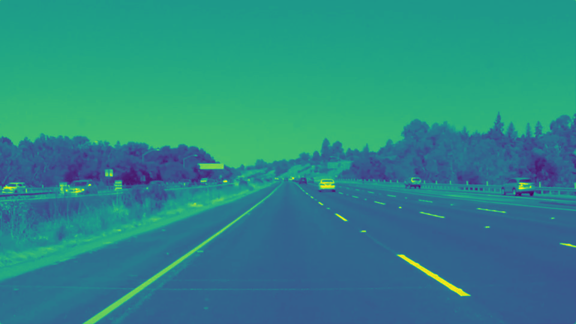
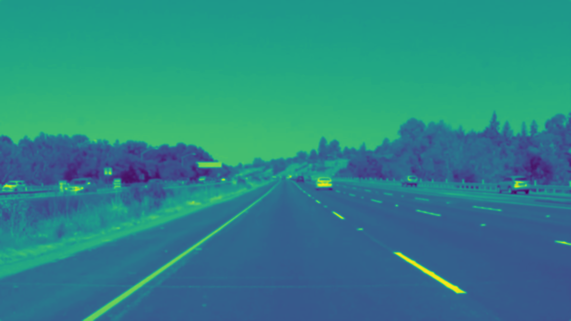
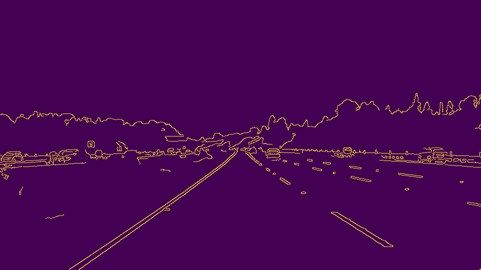
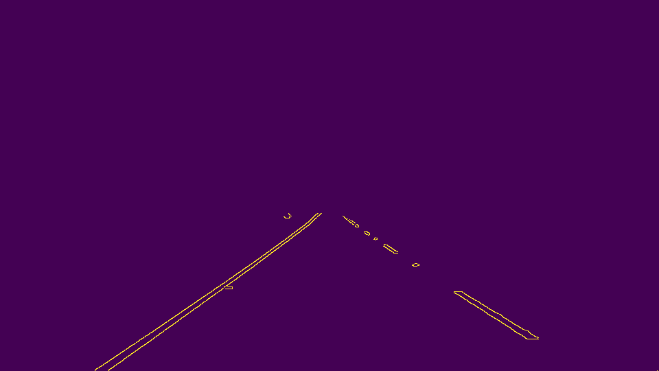
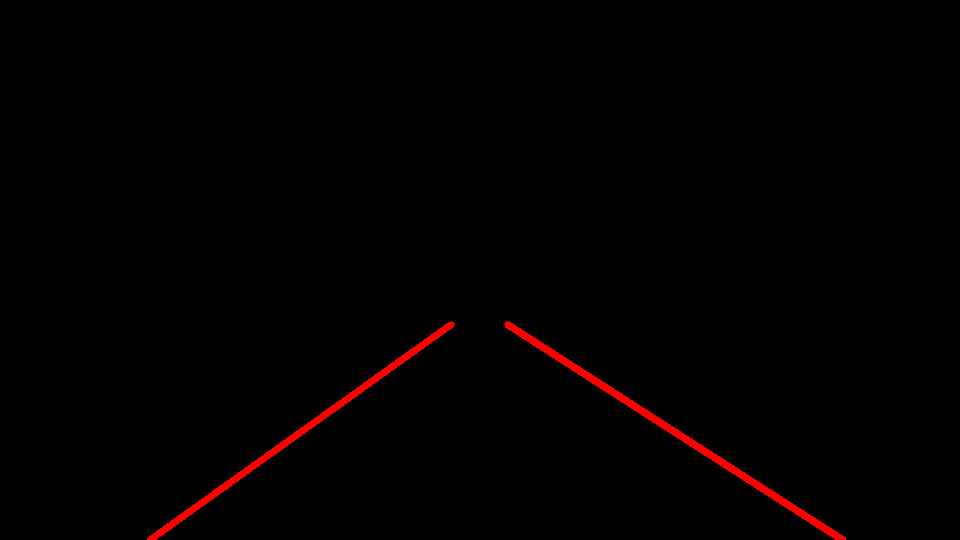
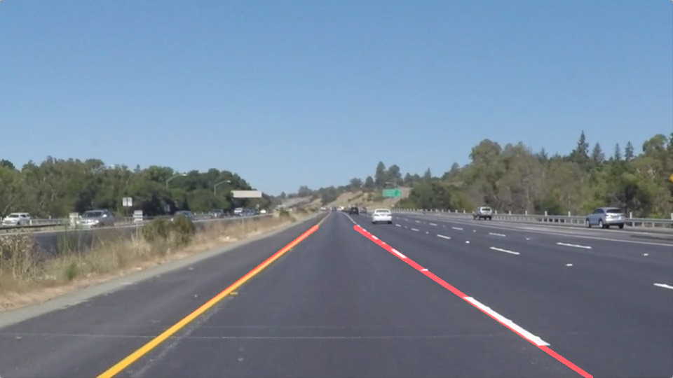

# **Finding Lane Lines on the Road** 

The goal of [this project](https://github.com/A2Amir/Finding-Lane-Lines-on-the-Road/blob/master/P1.ipynb) are the following: In this project, we will use the tools to identify lane lines on the road.  we will  develope a pipeline on a series of individual images, and later apply the result to a video stream (really just a series of images). Check out the [Video clip](./examples/P1_example.mp4) "P1_example.mp4" (also contained in this repository) to see what the output should look like after using the helper functions below. 

<video controls="controls">
  <source type="video/mp4" src="./examples/raw-lines-example.mp4"></source>
  
Your browser does not support the video element.

</video>

---

### 1.The pipeline:

The pipeline consisted of 7 steps:I'd like to include images to show how the pipeline works, here is how to include an image: 

1.  First read  the orginal image
 

2.  Then I converted the images to grayscale

 

  
3.  I applied on the grayscale image a gussian filter with the kernel of size 5.

 

  
4.  After determining the min and max thresholds for the canny transformation, I found the edges.

 

  
5.  on the canny image, the region of the interest was drwan by using vertices.
 

  

6.  Based on the region of the interest and with help of the hough_lines function the lane lines were extracted.

 

7.  At the end I added the weights of the original image and the lane line image.
 

In order to draw a single line on the left and right lanes, I modified the hough_lines() function by sperating slopes and intercepts belonging to the left  or right lane line using np.plolyfit then to calculate the coordinates of the first and end points of each lane line I averaged them on the zero axis and the make_coordinate function was used to calculate the coordinates of the left and right lane lines.

  
### 2. Test on Videos

 
 
 
